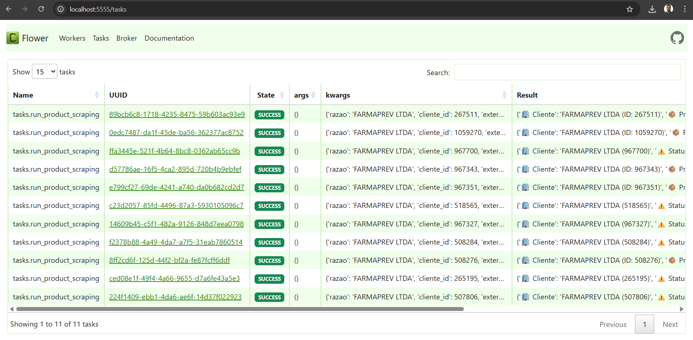
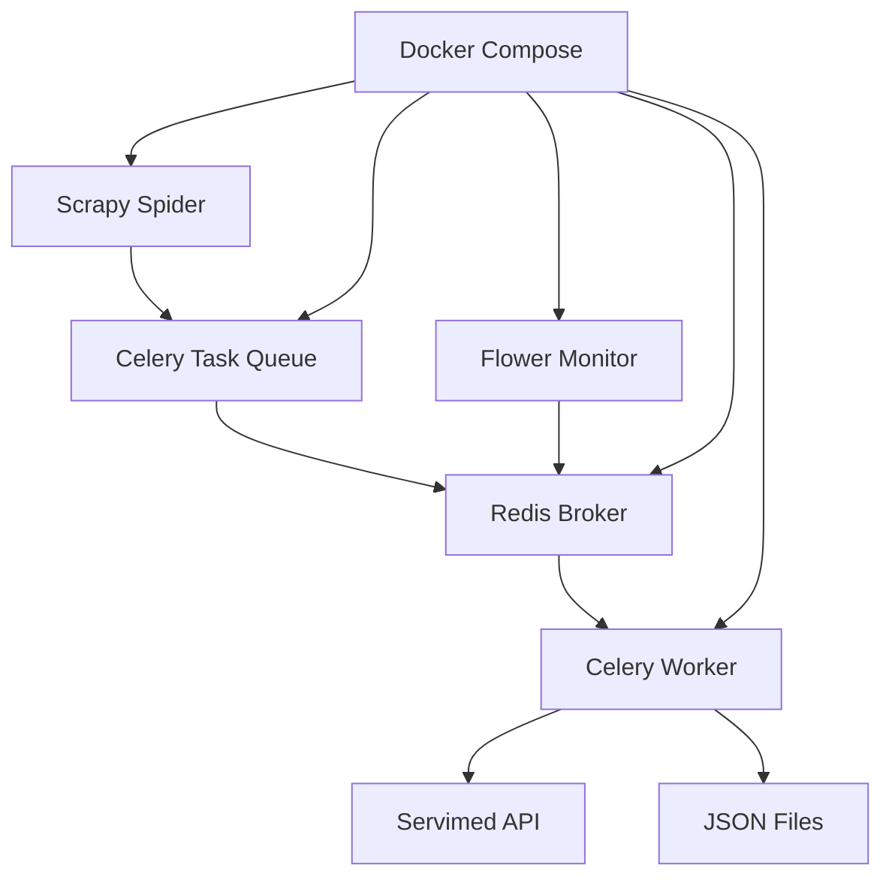

<h1 align="center">🕷️ Servimed Scraper</h1>

    

 
    
    
    
    
    

Este projeto é um sistema de web scraping distribuído para extrair dados do portal Servimed, utilizando <strong>Scrapy</strong> com processamento assíncrono via <strong>Celery</strong> e <strong>Redis</strong>. O sistema permite coletar grandes volumes de dados de forma eficiente e monitorar o progresso em tempo real através do Flower.

<h2>📋 Índice</h2>

<ul>
    <li><a href="#-funcionalidades">🚀 Funcionalidades</a></li>
    <li><a href="#-pré-requisitos">🔧 Pré-requisitos</a></li>
    <li><a href="#️-instalação">⚙️ Instalação</a></li>
    <li><a href="#-configuração-com-docker">🐳 Configuração com Docker</a></li>
    <li><a href="#-uso">📱 Uso</a></li>
    <li><a href="#-monitoramento">📊 Monitoramento</a></li>
    <li><a href="#️-arquitetura">🏗️ Arquitetura</a></li>
    <li><a href="#-estrutura-do-projeto">📁 Estrutura do Projeto</a></li>
    <li><a href="#-troubleshooting">🐛 Troubleshooting</a></li>
</ul>

<h2>🚀 Funcionalidades</h2>

<ul>
    <li>✅ <strong>Scraping distribuído</strong> com Scrapy + Celery</li>
    <li>✅ <strong>Processamento assíncrono</strong> de grandes volumes de dados</li>
    <li>✅ <strong>Monitoramento em tempo real</strong> com Flower</li>
    <li>✅ <strong>Containerização</strong> completa com Docker</li>
    <li>✅ <strong>Persistência</strong> de dados em JSON/JSONLines</li>
    <li>✅ <strong>Autenticação</strong> automática na API Servimed</li>
    <li>✅ <strong>Spider de descoberta</strong> para mapear empresas</li>
    <li>✅ <strong>Spider de produtos</strong> para extrair catálogos</li>
</ul>

<h2>🔧 Pré-requisitos</h2>

Antes de começar, certifique-se de ter instalado:

<h3>Windows</h3>
<ul>
    <li>🐳 <strong>Docker Desktop</strong> (<a href="https://www.docker.com/products/docker-desktop/">Download</a>)</li>
    <li>🐧 <strong>WSL 2</strong> (Windows Subsystem for Linux)</li>
    <li>📦 <strong>Git</strong> (<a href="https://git-scm.com/downloads">Download</a>)</li>
</ul>

<h4>Configurando WSL 2 no Windows</h4>
<pre><code># Execute como administrador
wsl --install
wsl --set-default-version 2

# Reinicie o computador após a instalação
</code></pre>

<h3>Linux/macOS</h3>
<ul>
    <li>🐳 <strong>Docker</strong> & <strong>Docker Compose</strong></li>
    <li>📦 <strong>Git</strong></li>
</ul>

<h2>⚙️ Instalação</h2>

<h3>1. Clone o repositório</h3>
<pre><code>git clone &lt;https://github.com/Werricsson-Santos/scrapy_servimed.git&gt;
cd scrapy_servimed
</code></pre>

<h3>2. Mudar para a branch correta</h3>

<strong>⚠️ Importante:</strong> Por padrão, o clone vem na branch <code>master</code>. Para utilizar este projeto, você deve mudar para a branch de desenvolvimento:

<pre><code>git checkout feature/nivel-2-celery-redis
</code></pre>

<h3>3. Configure as variáveis de ambiente</h3>

Crie um arquivo <code>.env</code> na raiz do projeto:

<pre><code># Credenciais Servimed
SERVIMED_USER=seu_usuario_aqui
SERVIMED_PASS=sua_senha_aqui

# Redis Configuration (use os valores padrão para Docker)
REDIS_URL=redis://redis:6379/0
</code></pre>

<strong>⚠️ Importante:</strong> Substitua <code>seu_usuario_aqui</code> e <code>sua_senha_aqui</code> pelas suas credenciais reais do Servimed.

<h2>🐳 Configuração com Docker</h2>

<h3>1. Construir e iniciar os serviços</h3>
<pre><code>docker-compose up --build -d
</code></pre>

Este comando irá:

<ul>
    <li>🔨 Construir a imagem Docker do projeto</li>
    <li>🚀 Iniciar o Redis (broker de mensagens)</li>
    <li>🐝 Iniciar o Celery Worker</li>
    <li>🌸 Iniciar o Flower (monitoramento)</li>
</ul>

<h3>2. Verificar se os containers estão rodando</h3>
<pre><code>docker-compose ps
</code></pre>

Você deve ver algo assim:

<pre><code>        Name                      Command               State           Ports         
-------------------------------------------------------------------------------------
celery-worker         python3 -m celery -A celery ...   Up                            
flower-servimed       python3 -m celery --broker= ...   Up      0.0.0.0:5555-&gt;5555/tcp
redis-servimed        docker-entrypoint.sh redis ...   Up      0.0.0.0:6379-&gt;6379/tcp
</code></pre>

<h2>📱 Uso</h2>

<h3>Como utilizar o sistema:</h3>

Este é um projeto de <strong>web scraping distribuído</strong> e requer Docker para ser executado.

<h4>1. Acessar o monitoramento Flower</h4>

Abra seu navegador e vá para:

<pre><code>http://localhost:5555
</code></pre>

Você verá a interface do Flower para monitorar as tasks em tempo real.

    

<h4>2. Executar o Spider de Descoberta</h4>

Para mapear as empresas disponíveis:

<pre><code>
# Executar o spider de descoberta
docker exec -it celery-worker scrapy crawl discovery
</code></pre>

<h4>3. Verificar os resultados</h4>

Após a execução, verifique os arquivos gerados, você deve ver os arquivos gerados na pasta <strong>"extractions"</strong>

<strong>Você também pode ver um resumo dos resultados através do Flower:</strong>

<pre><code><a href="http://localhost:5555">http://localhost:5555</a>
</code></pre>

<h4>4. Executar outros Spiders</h4>
<pre><code># Spider de produtos
scrapy crawl product_spider

# Outros spiders disponíveis
scrapy crawl servimed_spider
scrapy crawl cotefacil_spider
</code></pre>

<h2>📊 Monitoramento</h2>

<h3>Flower Dashboard</h3>
<ul>
    <li>🌐 <strong>URL:</strong> <a href="http://localhost:5555">http://localhost:5555</a></li>
    <li>📈 <strong>Funcionalidades:</strong>
        <ul>
            <li>Visualizar tasks ativas, processadas e com erro</li>
            <li>Monitor de performance em tempo real</li>
            <li>Histórico de execução</li>
            <li>Estatísticas dos workers</li>
        </ul>
    </li>
</ul>

<h3>Logs dos Containers</h3>
<pre><code># Logs do worker Celery
docker-compose logs -f worker

# Logs do Redis
docker-compose logs -f redis

# Logs do Flower
docker-compose logs -f flower

# Logs de todos os serviços
docker-compose logs -f
</code></pre>

<h2>🏗️ Arquitetura</h2>

<h3>Componentes:</h3>
<ul>
    <li><strong>🕷️ Scrapy Spiders:</strong> Coletam dados e criam tasks</li>
    <li><strong>📋 Celery:</strong> Gerencia a fila de processamento assíncrono</li>
    <li><strong>🔴 Redis:</strong> Broker de mensagens e armazenamento de resultados</li>
    <li><strong>👷 Workers:</strong> Processam as tasks de scraping</li>
    <li><strong>🌸 Flower:</strong> Interface web para monitoramento</li>
    <li><strong>🐳 Docker:</strong> Containerização e orquestração</li>
</ul>

<h2>📁 Estrutura do Projeto</h2>

<ul>
    <li><strong>docker-compose.yml:</strong> Orquestração dos serviços</li>
    <li><strong>Dockerfile:</strong> Imagem Docker do projeto</li>
    <li><strong>requirements.txt:</strong> Dependências Python</li>
    <li><strong>.env:</strong> Variáveis de ambiente (criar)</li>
    <li><strong>README.md:</strong> Esta documentação</li>
    <li><strong>extractions/:</strong> Dados extraídos
        <ul>
            <li><strong>discovery.json:</strong> Resultado do spider de descoberta</li>
            <li><strong>product_spider.json:</strong> Resultado do spider de produtos</li>
            <li><strong>discovery/:</strong> Execuções por data</li>
        </ul>
    </li>
    <li><strong>servimed/:</strong> Código fonte principal
        <ul>
            <li><strong>celery_app.py:</strong> Configuração do Celery</li>
            <li><strong>tasks.py:</strong> Tasks assíncronas</li>
            <li><strong>scrapy.cfg:</strong> Configuração do Scrapy</li>
            <li><strong>servimed/:</strong> Projeto Scrapy
                <ul>
                    <li><strong>settings.py:</strong> Configurações do Scrapy</li>
                    <li><strong>items.py:</strong> Definição de itens</li>
                    <li><strong>pipelines.py:</strong> Pipelines de processamento</li>
                    <li><strong>middlewares.py:</strong> Middlewares customizados</li>
                    <li><strong>spiders/:</strong> Spiders de scraping
                        <ul>
                            <li><strong>discovery_spider.py:</strong> Spider de descoberta</li>
                            <li><strong>products_spider.py:</strong> Spider de produtos</li>
                            <li><strong>servimed_spider.py:</strong> Spider principal</li>
                            <li><strong>cotefacil_spider.py:</strong> Spider CoTE Fácil</li>
                        </ul>
                    </li>
                </ul>
            </li>
        </ul>
    </li>
</ul>

<h2>🐛 Troubleshooting</h2>

<h3>Problemas Comuns</h3>

<h4>1. 🚫 Containers não iniciam</h4>
<pre><code># Verificar logs
docker-compose logs

# Reconstruir containers
docker-compose down
docker-compose up --build -d
</code></pre>

<h4>2. 🔐 Erro de autenticação</h4>
<ul>
    <li>Verifique se as credenciais no <code>.env</code> estão corretas</li>
    <li>Confirme se o usuário tem acesso ao portal Servimed</li>
</ul>

<h4>3. 📡 Flower não acessível</h4>
<pre><code># Verificar se a porta 5555 está livre
netstat -an | findstr 5555  # Windows
netstat -an | grep 5555     # Linux/macOS

# Reiniciar o serviço Flower
docker-compose restart flower
</code></pre>

<h4>4. 💾 Redis conexão falhou</h4>
<pre><code># Verificar status do Redis
docker-compose exec redis redis-cli ping

# Deve retornar: PONG
</code></pre>

<h4>5. 🕷️ Spider não encontra dados</h4>
<ul>
    <li>Verifique os logs do worker: <code>docker-compose logs -f worker</code></li>
    <li>Confirme se a API do Servimed está disponível</li>
    <li>Teste a autenticação manualmente</li>
</ul>

<h3>Comandos Úteis</h3>
<pre><code># Parar todos os serviços
docker-compose down

# Limpar volumes (⚠️ apaga dados do Redis)
docker-compose down -v

# Rebuild completo
docker-compose down
docker-compose build --no-cache
docker-compose up -d

# Entrar no container para debug
docker exec -it celery-worker bash

# Monitorar recursos
docker stats
</code></pre>

<h2>Requisitos Técnicos</h2>

<h3>Linguagens e Frameworks:</h3>
<ul>
    <li><strong>Core:</strong> Python 3.11+, Scrapy 2.11.2, Celery 5.6.2</li>
    <li><strong>Infraestrutura:</strong> Docker & Docker Compose, Redis</li>
    <li><strong>Monitoramento:</strong> Flower (interface web)</li>
    <li><strong>Persistência:</strong> JSON/JSONLines via localStorage</li>
    <li><strong>Autenticação:</strong> JWT via curl-cffi</li>
</ul>

    
<strong>💡 Dica:</strong> Mantenha sempre o Flower aberto durante a execução para acompanhar o progresso das tasks em tempo real!

    
<strong>Happy Scraping!</strong> 🕷️✨

<h2>Werricsson Santos</h2>
    

   

    
     

